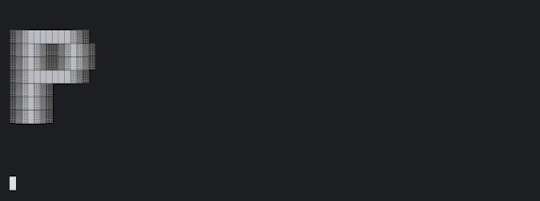
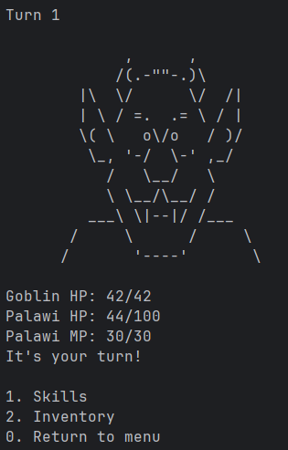
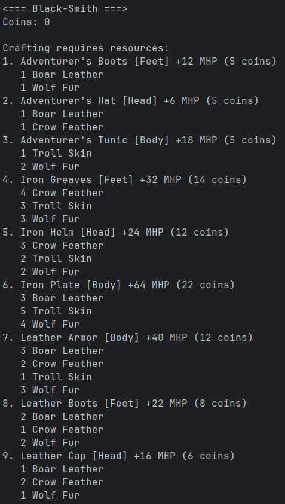
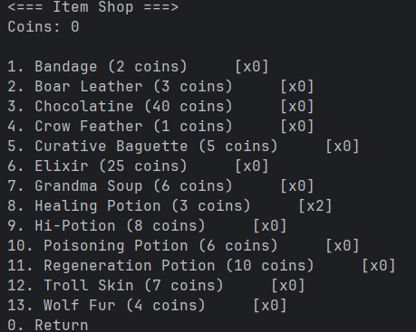
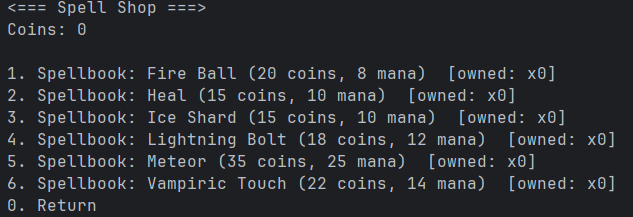
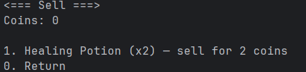

# Polaris — a tiny turn-based console RPG



A compact, text-driven RPG with chapters, turn-based combat, loot, crafting, spellbooks, and a light economy. Everything runs in the terminal, with sound effects and music via the `beep` audio stack.

**⚠️ KNOWN BUG : DO NOT HIT ENTER IN THE COMBAT SCREEN OR SPAM ENTER IN DIALOGUES ⚠️**

This README documents the game’s features, how to run it, and how the codebase is laid out.

---

## Quick start

### Requirements (skip if using executable in releases)

* Go 1.20+ (earlier versions may work)
* A terminal that supports ANSI escape codes (for screen clear / flash)
* Audio output (the game uses MP3/WAV assets in `assets/audio`)

### Run

If you are on Windows, download the lastest release and launch polaris.exe.
For others, download the repository and run launcher.sh or :

```bash
go run .\cmd\main.go
```

That boots the title animation and music. Press **Enter** to start, then follow on-screen prompts.

---

## How to play (controls)

* Menus use **numbers** + **Enter**.
* **0** usually returns to the previous menu.
* During story text, press **Enter** to continue.
* In combat:

  * **1**: Skills
  * **2**: Inventory (usable items)
  * **0**: Return to main menu (exits the current fight)

> Tip: The “Training Fight” from the main menu is a safe place to grind.

---

## Game flow

1. **Title screen** with animated ASCII and music.
2. **Character creation**: pick a name and a class (Human/Elf/Dwarf).
3. **Main menu**: start the next chapter, view character, check inventory, visit shops, craft at the blacksmith, do training fights, or quit.
4. **Chapters**: each chapter mixes narrative with fights. Bosses gate progression.
5. **Rewards**: win coins, EXP, and loot (crafting mats, items, or abilities).
6. **Spend**: buy/sell in the shops, craft gear at the black-smith, and upgrade inventory capacity.

---

## Combat system



Turn-based and deterministic in UI, with controlled randomness inside:

* **Initiative** decides who goes first on the first round.
* **Mana regeneration**: each of your turns you passively regen MP (by class).
* **Critical hits (player)**: offensive skills (including Punch) have a flat crit chance (25%) unless stated otherwise. Heals don’t crit.
* **Critical hits (monsters)**: each monster has a target cadence `CritEvery`. Crits are **randomized** around that cadence with a “pity” effect:
* **Damage & HP**: damage and healing are computed in floats but **rounded at application** so numbers on screen always match the true HP total. HP never drops below 0 or above max.
* **On death**: you “respawn” to half max HP with a short hint + death music, then you’re returned to menus.

---

## Character & progression

**Classes**

* **Human (Normal):** HP 50/100, MP regen 5/turn
* **Elf (Hard):** HP 40/80, MP regen 6/turn
* **Dwarf (Easy):** HP 60/120, MP regen 4/turn

**Leveling**

* EXP gains are rounded.
* Level up when `EXP >= EXPToNextLevel`:

  * New threshold = `round(prev * 1.15)`
  * +15 Max HP, full heal
  * +2 Initiative
  * +5 Max MP, full MP
  * Level-up messages explain the gains.

---

## Inventory, items, and capacity

* **Capacity**: starts at 10. You can purchase upgrades (+10 each) up to 10 times.
* **Inventory view** shows items, skills, and equipment. After using/equipping from the inventory, you **stay** in the inventory menu for faster management.

**Selected consumables**

* **Potion**: +50 HP
* **Bandage**: +20 HP
* **Hi-Potion**: +120 HP
* **Grandma Soup**: +80 HP
* **Baguette**: +60 HP
* **Elixir**: Full heal
* **Regen Potion**: 4 ticks of +15 HP over time
* **Chocolatine**: Fully heals with a celebratory ASCII cut-in

All healing amounts apply with the same rounding rules used everywhere else.

---

## Skills (spellbooks)

Buy spellbooks to gain skill charges (they stack). Mana is spent on cast.

* **Punch** — free, scales with level, can crit (2× on crit for Punch).
* **Fire Ball** — 18 base, can crit (\~1.75×).
* **Ice Shard** — 14 base, can crit (\~1.75×).
* **Lightning Bolt** — 12–28 random, can crit (\~1.75×).
* **Meteor** — 35 base, can crit (\~1.75×).
* **Vampiric Touch** — 14 base, can crit (\~1.75×), heals you for 50% of damage dealt.
* **Heal** — +35 HP, **no critical**.

---

## Equipment & crafting (black-smith)



Three slots: **Head**, **Body**, **Feet**. Equipment increases **Max HP** (shown as “+MHP”). Equipping/unequipping correctly adjusts current Max HP and clamps current HP if necessary.

**Sets available**

* **Adventurer**: Hat / Tunic / Boots
* **Leather**: Cap / Armor / Boots
* **Iron**: Helm / Plate / Greaves

Each recipe costs coins + materials (from loot). Prices and recipes are balanced for early-game progression.

**Black-smith UI**

* Main list shows each piece: `[slot] +MHP (coins)` and per-piece material requirements.
* **Help** page aggregates **full set** totals:

  * Per-piece MHP, coins
  * **Full set** required materials
  * **Full set** total coins
  * **Full set** total MHP

---

## Shops (buy, sell, upgrade)

### Item Shop


* Items are listed alphabetically with current **owned count**.
* Choose an item, then enter the **quantity** you want.
* Capacity and funds are validated; you’ll get a helpful message if you don’t have enough coins or space.

### Spell Shop


* Buy spellbooks. Each purchase adds one to your stack of that spell.
* Shows **mana cost** and current owned count.
* `0` returns.

### Sell


* Sell **anything you own** (items, equipment, or spellbooks) at **50%** of the listed price.
* Equipment currently equipped can’t be sold (unequip first).

### Inventory upgrades

* “Upgrade Inventory (+10)” costs 7 coins, up to 10 times.

---

## Audio & visuals

* **Music** and **SFX** are handled by `github.com/faiface/beep` and friends.
* MP3/WAV decoding is automatic; streams are resampled to a common sample rate for consistent playback.
* Terminal screen effects:

  * **ClearScreen** for a clean UI each step
  * **Flash** effect on enemy attack (subtle jitter + quick invert)

---

## Directory layout

```
assets/
  audio/           // music loop, SFX
  readme/          // files useful for readme
internal/
  audiosystem/     // decoding (preload + cached play)
  chapters/        // chapter scripts & background music control
  character/       // creation, info screen, EXP & level-up, inventory ops
  equipment/       // data (pieces, recipes) + equip/unequip + black-smith UI
  fightsystem/     // turn loop, training fight, victory rewards
  menu/            // title music, main menu, admin shortcut
  monsters/        // monster data, art, attack patterns, crit scheduler
  objects/         // item data + per-item effects
  shop/            // item/spell buying, selling, capacity upgrades
  skills/          // skills registry + per-skill effects & crits
utils/
  // shared helpers: screen clear, typewriter text, ascii print,
  // damage/heal with rounding, HP strings, death/respawn, turn bus
main.go            // entry point: preload select SFX, start game
```

---

## Known limitations

* No save/load system yet.
* Terminal flash/jitter depends on ANSI support; very minimal terminals may ignore it.

---

## Credits & miscellany

* Audio playback built on the `beep` stack.
* ASCII art sprinkled through chapters and special items.
* **Game made by** :
  * Baptiste D.M.
  * Jules D.
  * Nin L.P.
* Music and SFX from :
	* Tomodachi Life's Tomodachi Quest by Nintendo
	* Deltarune by Toby Fox
	* Undetale by Toby Fox

# Have fun!
